# VNetFamily-Tensorflow
> There are some VNet Variant Networks that implement with tensorflow

## Requirements
* Tensorflow 1.8
* Python 3.5

## VNet
you can see the ***paper***, please refer to this [link](http://campar.in.tum.de/pub/milletari2016Vnet/milletari2016Vnet.pdf)
### What is the VNet

## AttentionGatedVNet
you can see the ***paper***, please refer to this [link](https://openreview.net/pdf?id=BJtn7-3sM)
### What is the AttentionGate
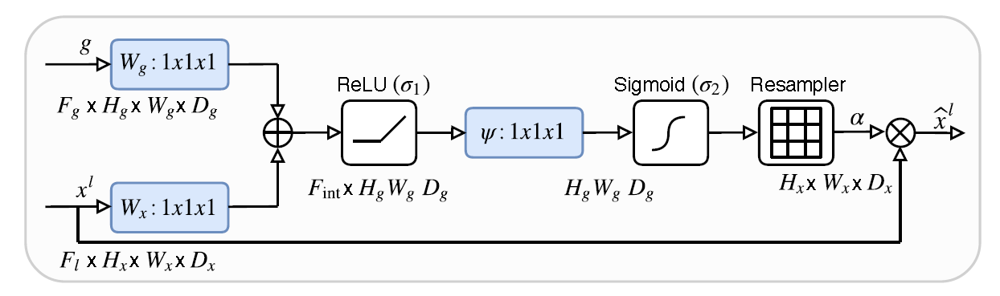
### What is the AttentionGateVNet
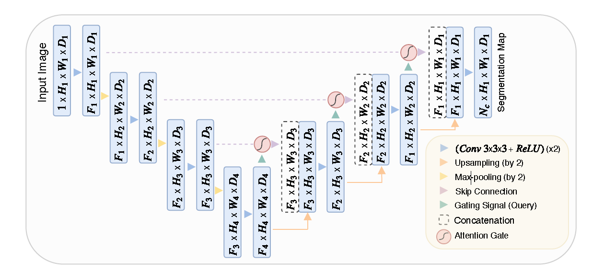

## DualAttentionVNet
you can see the ***paper***, please refer to this [link](https://arxiv.org/abs/1809.02983)
### What is the DualAttention
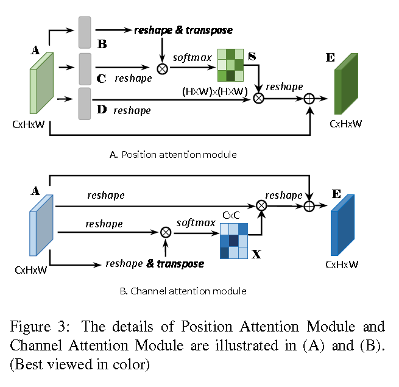
### What is the DualAttentionNet
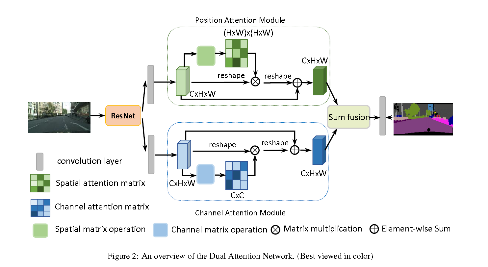

## FusionVNet
you can see the ***paper***, please refer to this [link](https://hal-univ-bourgogne.archives-ouvertes.fr/hal-02060222/document)
### What is the FusionVNet
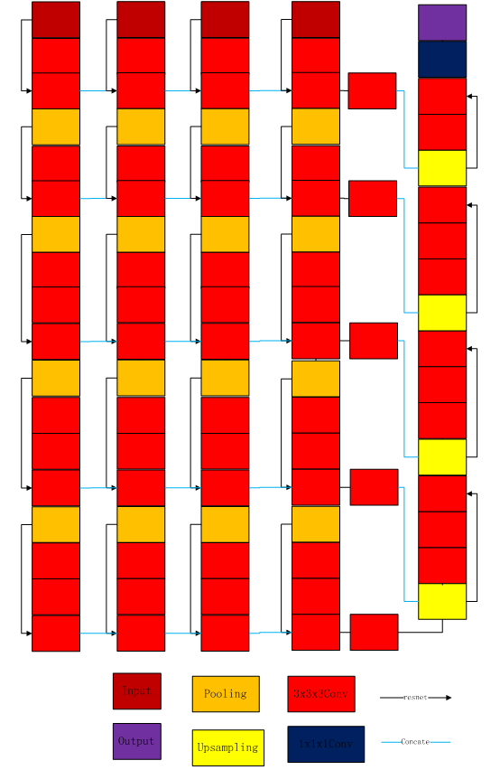

## NestedVNet(VNet++)
you can see the ***paper***, please refer to this [link](https://arxiv.org/abs/1807.10165)
### What is the VNet++
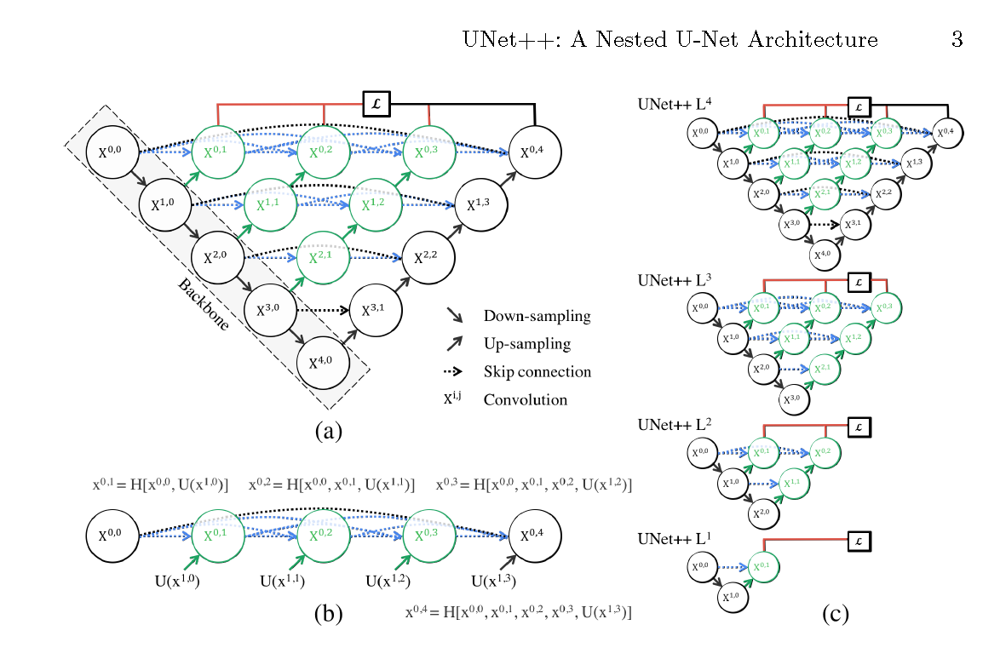

## SEVNet
you can see the ***paper***, please refer to this [link](https://arxiv.org/abs/1709.01507)
### What is the SEModel
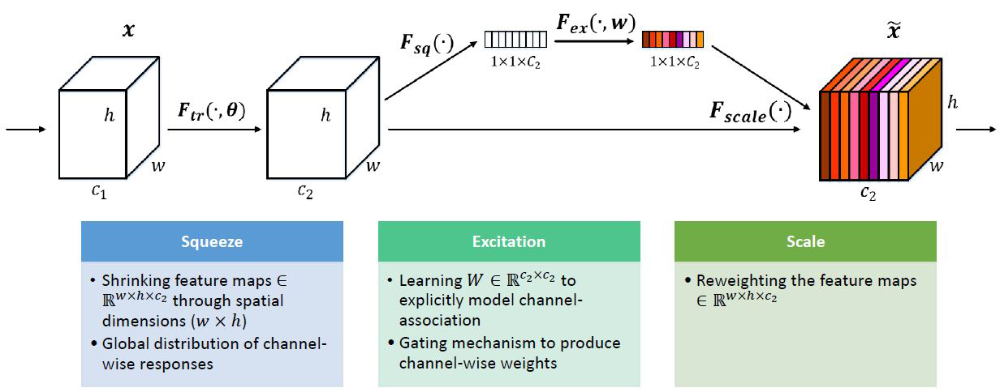
### What is the SEVNet
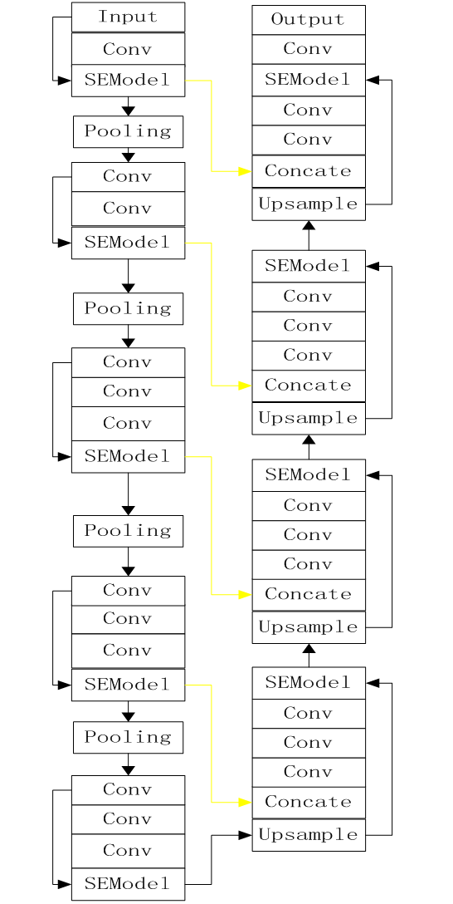

## SCSEVNet
you can see the ***paper***, please refer to this [link](https://arxiv.org/abs/1803.02579)
### What is the SCSEModel
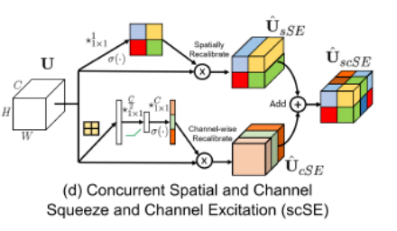
### What is the SCSEVNet
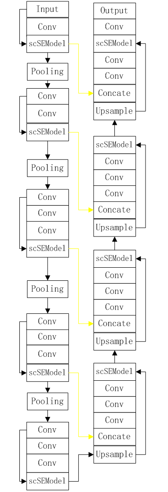

## GAVNet
you can see the ***paper***, please refer to this [link](https://arxiv.org/abs/1907.12930)
### What is the GrideAttentionModel
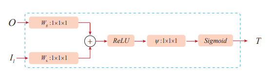
### What is the GAVNet
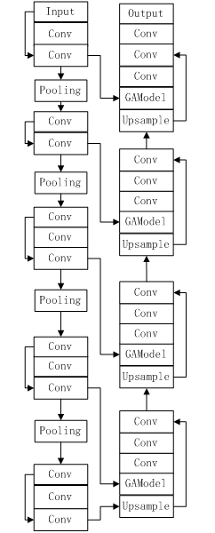

## NonLocalVNet
you can see the ***paper***, please refer to this [link](http://openaccess.thecvf.com/content_cvpr_2018/papers/Wang_Non-Local_Neural_Networks_CVPR_2018_paper.pdf)
### What is the NonLocalBlock
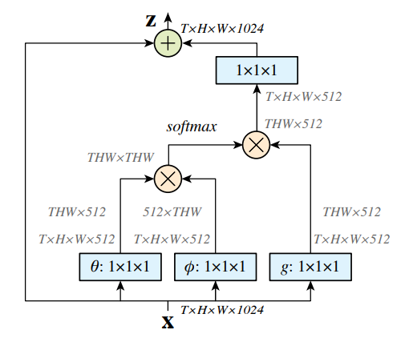
### What is the NonLocalVNet

## PEVNet
you can see the ***paper***, please refer to this [link](https://arxiv.org/abs/1906.04649)
### What is the PEModel

### What is the PEVNet
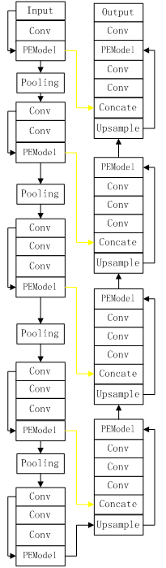

## ETVNet
you can see the ***paper***, please refer to this [link](https://arxiv.org/abs/1907.10936)
### What is the ETModel
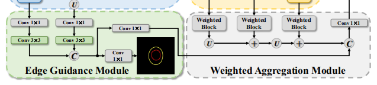
### What is the ETVNet
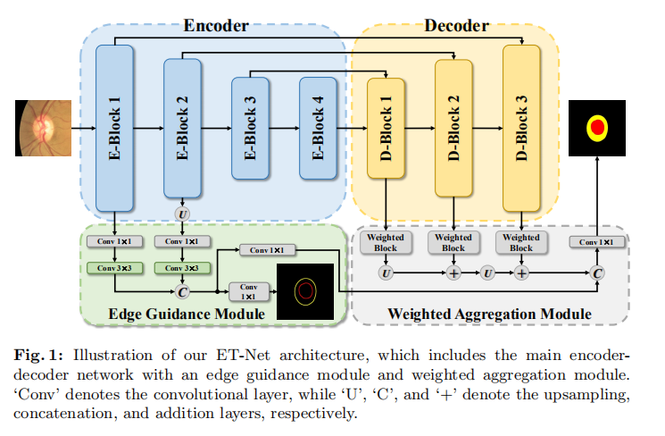

## Author
junqiangchen

## Contact
* https://github.com/junqiangchen
* email: 1207173174@qq.com
* WeChat Public number: 最新医学影像技术
* 
